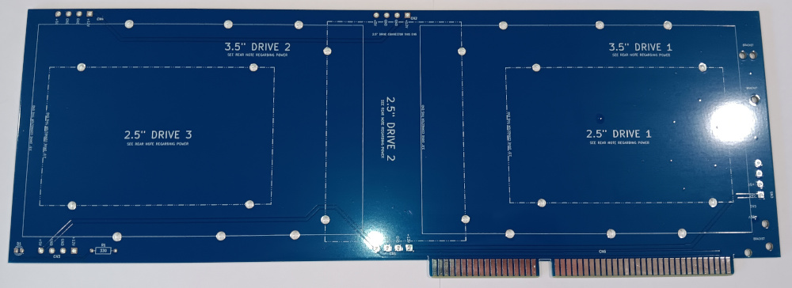
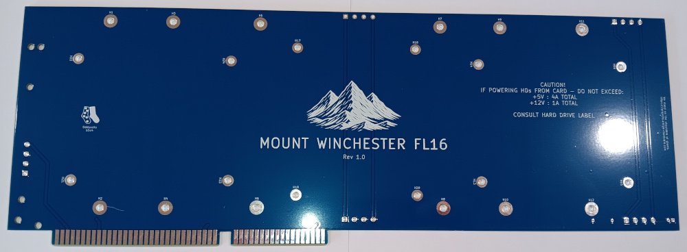
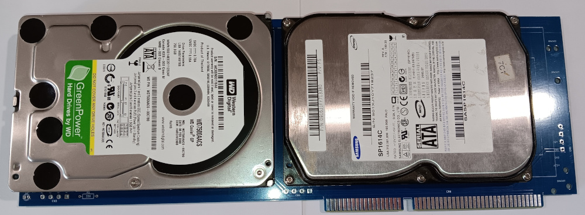
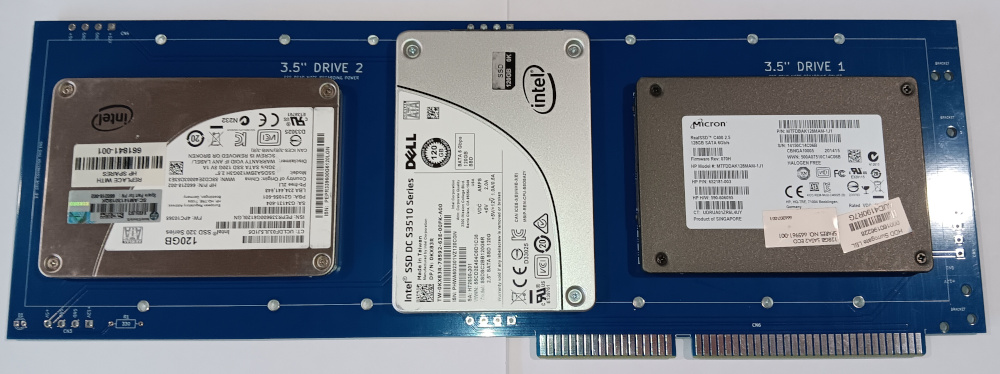
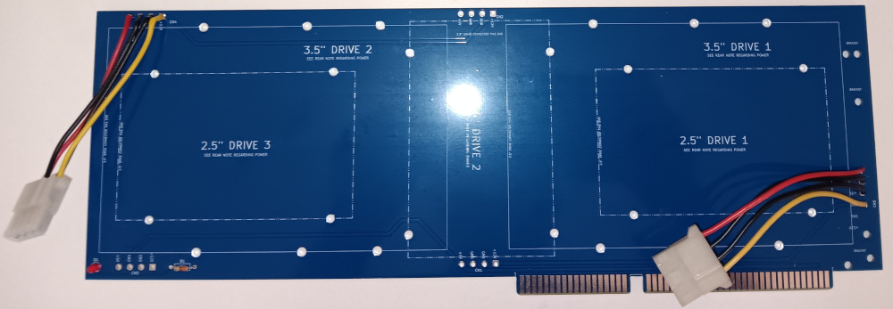

# Mount Winchester FL16

## Description
A full length 16bit ISA card for mounting hard disks (aka a HardCard). Please note, it's not a hard drive controller but a convenient method of mounting hard drives in legacy systems

**Features**
* Mount up to 3 x 2.5" hard disks
* Mount up to 2 x 3.5" hard disks
* Optionally power the hard Disks directly from the card, by attaching Molex or SATA power cables to any of the 5 x power points
* Useful in PCs and can also be used in the ISA slots of Big Box Amigas as it only needs the ISA slots for power
* Power LED

## Bill of Materials

| Qty | Component                        |
|:---:|----------------------------------|
| 1   | 330Ω Axial Resistor - ¼ watt     |
| 1   | 3mm LED                          |

Molex or SATA power cable "pigtails" (optional up to 5) if you wish to power hard drives directly from the card

## Power
If powering HDs from the card, do not exceed:

* +12V : 1A Total
* +5V (16bit Slot) : 4A Total
* +5V (8bit Slot) : 2.5A Total

Consult the label on your hard drives.

## Support Me
* [My Projects](https://projects.amiga-hardware.com) - Donate on this page
* [Order the Mount Winchester FL16 PCB](https://www.pcbway.com/project/shareproject/Mount_Winchester_FL16_16bit_ISA_HardCard_9fa64691.html)
